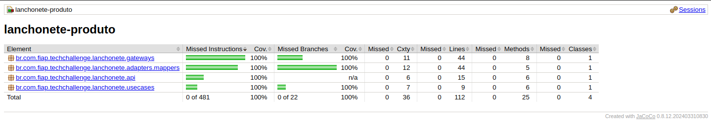
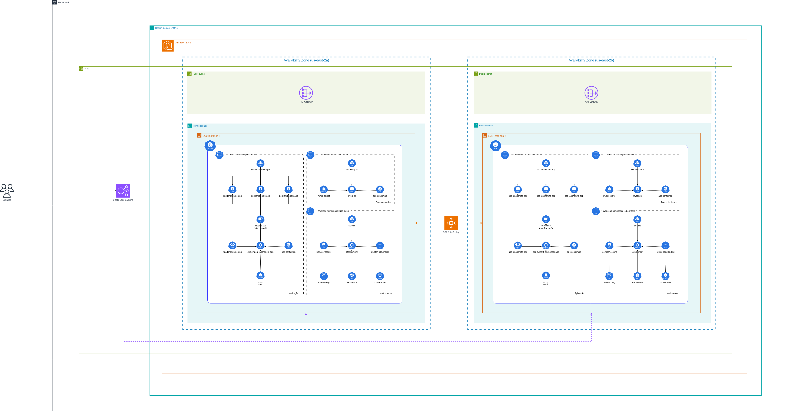

# Tech Challenge - API Lanchonete Produto

API resopnsável por gerenciar produtos de uma lanchonete.

# Pré-requisitos
1. Docker
   1. Para instalação [clique aqui](https://www.docker.com/get-started/)
2. Docker compose
   1. Para instalação [clique aqui](https://docs.docker.com/compose/install/)
3. Docker Desktop
   1. Para instalação [clique aqui](https://www.docker.com/products/docker-desktop/)
4. Habilitar o Kubernetes através do menu de configuração do Docker Desktop
   1. Após abrir o Docker Desktop, clique na engrnagem no canto superior direito;
   2. Vá em "Kubernetes"
   3. Habilite o Kubernetes selecionando o check box "Enable Kubernetes"

# Para executar o projeto:
1. Acesse via terminal a pasta do projeto
2. Execute em ordem os comandos abaixo: 
```bash
kubectl apply -f kubernetes/  # você vai configurar o configmap, o hpa e as métricas do cluster
cd kubernetes                 # você vai acessar a pasta com os demais arquivos do cluster kubernetes
kubectl apply -f banco_dados/ # você vai aplicar os arquivos necessários para subir o banco de dados 
kubectl apply -f aplicacao/   # você vai aplicar os arquivos necessários para subir a aplicação
```

### Obs.: Caso esteja utilizando o minikube para rodar seu cluster local, é necessário executar o campo abaixo:
```bash
kubectl get svc # neste comando você listará todas as services. Localize a service do app (svc-lanchonete-app)
kubectl port-forward svc-lanchonete-app 8080:80 # neste comando você vai direcionar todas as chamadas da porta 8080 para a porta 80 do cluster
```

#### Após os passos acima, a API estará funcionando e será possível realizar as operações, conforme descrito abaixo.

# Passo a passo funcional da API

### **Operações Disponíveis nesta API**

  
**Rota:** `/produto`  
**Descrição:** Realiza o cadastro de um produto.  
**Body:**

```json
{
   "nome": "string",
   "categoria": "LANCHE",
   "preco": 0,
   "descricao": "string",
   "imagemPath": "string"
}
```
  
  
**Rota:** `/produto`  
**Descrição:** Realiza a alteração de um produto.  
**Body:**
```json
{
   "id": 0,
   "nome": "string",
   "categoria": "LANCHE",
   "preco": 0,
   "descricao": "string",
   "imagemPath": "string"
}
```


**Rota:** `/produto/{categoria}`  
**Descrição:** Realiza a busca de produtos por categoria.


**Rota:** `/produto/busca/{id}`  
**Descrição:** Realiza a busca de um produto por id.


**Rota:** `/produto/{id}`  
**Descrição:** Deleta um produto por id.
# Documentações

Link da documentação com o desenho do DDD: [Clique aqui para acessar o Miro](https://miro.com/app/board/uXjVKHPTdLg=/?share_link_id=544608334788)
<br>
Após subir a aplicação, para acessar o Swagger [Clique aqui](http://localhost:8080/swagger-ui/index.html)

# Relatório de cobertura de teste  


# Desenho de arquitetura do projeto

